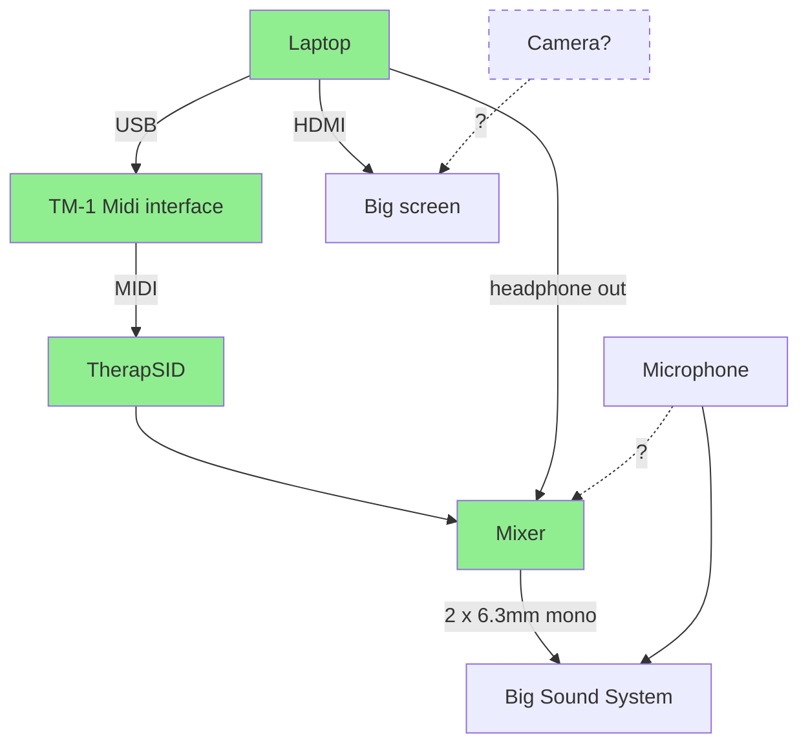

# Sidfactory 2 with ASID support

- [Tubesockor](https://www.youtube.com/@tubesockor) (Thomas Jansson)
- Youth (Michel de Bree)

- [ ] How much time do we need/have?

In short:

- Brief Sidfactory 2 introduction/commercial (Michel)
  - No demo, only screenshots in presentation
- Short intro about ASID and how it came about in SF2 (Thomas)
  - Open source
- Live demo (Thomas)
  - Live tweaking of SID playing in SF2
  - Remix SID from the compo?
  - Show different chips?

## Brief introduction about Sidfactory 2

- Highlights (add screenshots)
  - Multi-platform
    - Windows
    - MacOS
    - Linux
  - Multiple routines
    - Laxity drivers
    - JCH's Newplayer
  - Multiple songs
  - Unlimited undo
  - Imports
    - Goattracker
    - Cheesecutter
    - MOD
  - Well documented (help overlay)
  - Open-source
  - Built by legends Laxity & JCH
  - ASID support!
- The team
  - Laxity
    - Owner, lead, design, allmost all code
  - JCH
    - Converters, help overlay, design, documentation
  - Youth
    - MacOS version, Github, small functionality
  - Tubesockor
    - Hardware support (ASID)
- Examples of music/musicians that use SF2 (screenshots from demos)
  - Laxity, JCH
  - SMC
  - Vincenzo
  - The Syndrom
  - Animal? ;)
- Introduction about ASID
  - What is it?
  - How did it end up in SF2?
- SidFactory 2 roadmap
  - ASID
  - Multispeed
  - MIDI in?
  - Full screen
  - Commodore 64 font
  - Say something about most requested features like saving instruments?
- Call to action
  - Give it a try
  - Where to get SF2
  - How to contact us
  - How to report bugs/request features

## Demo

- Live remixing of a SID
- Other chips

[Example by LukHash](https://www.youtube.com/watch?v=2-baQ6JwGg8)

### Setup

- Green = equipment we bring with us
- [ ] Is there a mic present or should we plug one into the mixer?
- [ ] Can the knobtwiddeling be filmed live on stage and streamed to the big screen?
- [ ] How many plugs do we have?
