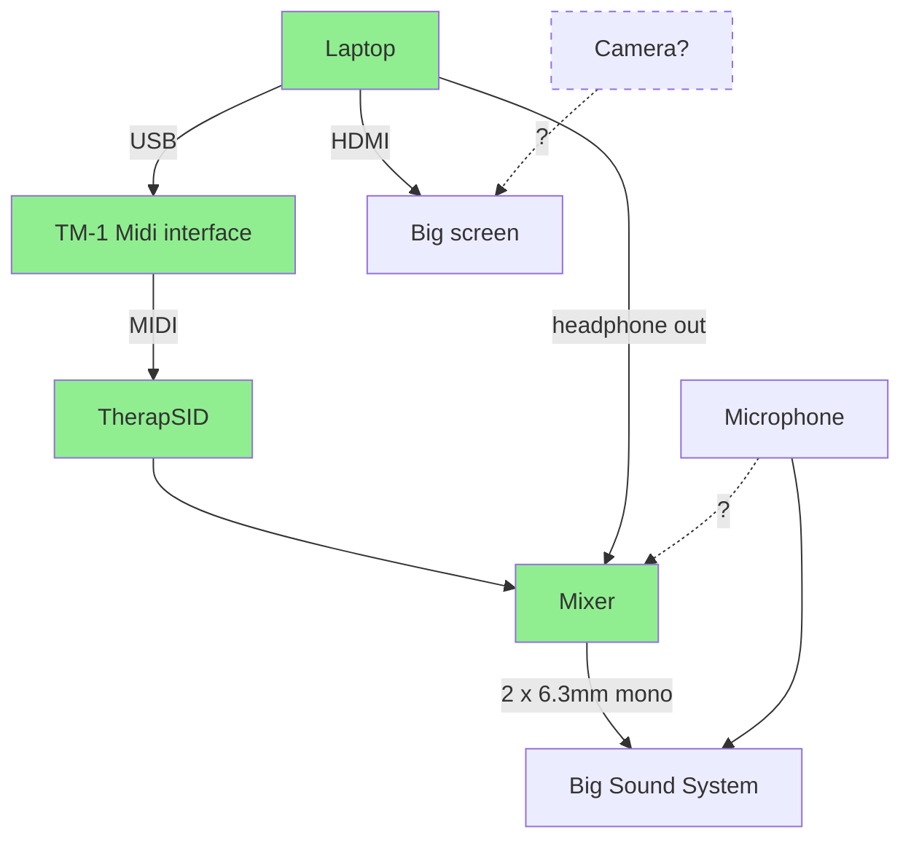

# Sidfactory 2 with ASID support

- [Tubesockor](https://www.youtube.com/@tubesockor) (Thomas Jansson)
- Youth (Michel de Bree)

## Brief introduction about Sidfactory 2

- The team
  - Laxity
  - JCH
  - Youth
  - Tubesockor
- Highlights
  - Multi-platform, open-source, multiple routines and stuff
  - ASID support!
- Introduction about ASID
  - What is it?
  - How did it end up in SF2?
- SidFactory 2 roadmap
  - ASID
  - Multispeed
  - Full screen
  - Commodore 64 font
  - Say something about most requested features like saving instruments?

## Demo

- Live remixing of a SID
- Other chips

[Example by LukHash](https://www.youtube.com/watch?v=2-baQ6JwGg8)

### Setup

- Green = equipment we bring with us
- [ ] Is there a mic present or should we plug one into the mixer?
- [ ] Can the knobtwiddeling be filmed live on stage and streamed to the big screen?
- [ ] How many plugs do we have?
